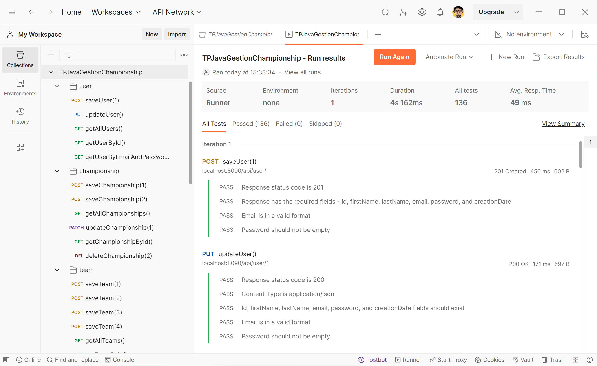

# TP Java Gestion Championnat

_IPI CDEV 2023-2024 - JC. Kleinbourg_

## Exercice Java Spring JPA

Application qui permet de gérer les résultats d’un championnat de foot. Les utilisateurs une fois connectés pourront créer des championnats, des équipes, des journées et saisir des résultats. Les visiteurs du site pourront consulter les championnats, les équipes et voir le classement d’un championnat.


## Lancement de l'application avec Docker

```Bash
# Exécution du conteneur MySQL / phpmyadmin
docker-compose up -d

# Build Maven
mvn package
# Exécution du JAR
java -jar .\target\GestionChampionnat-0.0.1-SNAPSHOT.jar
```

L'application est servie sur le port 8090:
```
localhost:8090/api/
```


## [Collection Postman des routes API](info/postman-collection/TPJavaGestionChampionship.postman_collection.json)
```
info/postman-collection/TPJavaGestionChampionship.postman_collection.json
```

Le fichier Postman de collection comprend les syntaxes utilisées par l'API. Celles-ci sont documentées dans la Javadoc des méthodes des contrôleurs.

- ### Utilisateurs (/api/user/)
  - getAllUsers()
  - getUserById()
  - getUserByEmailAndPassword()
  - saveUser()
  - updateUser()
  - deleteUser()
- ### Championnats (/api/championship/)
  - getAllChampionships()
  - getChampionshipById()
  - saveChampionship()
  - updateChampionship()
  - deleteChampionship()
- ### Équipes (/api/team/)
  - getAllTeams()
  - getAllTeamsByChampionshipId()
  - getTeamById()
  - saveTeam()
  - addTeamToChampionship()
  - updateTeam()
  - deleteTeam()
- ### Journées (/api/day/)
  - getAllDays()
  - getAllDaysByChampionshipId()
  - getDayById()
  - saveDay()
  - updateDay()
  - deleteDay()
- ### Résultats (/api/game/)
  - getAllGames()
  - getAllGamesByChampionshipId()
  - getAllGamesByDayId()
  - getGameById()
  - saveGame()
  - updateGame()
  - deleteGame()

_NB: Il a été choisi que l'API renvoie 204 No Content au lieu de tableaux vides._

## [Résultats des tests](info/postman-resultat-test/TPJavaGestionChampionship.postman_test_run.json)

La collection Postman comprend 136 tests de conformité sur l'ensemble des routes de l'API. Les résultats sont dans ce fichier :

```
info/postman-resultat-test/TPJavaGestionChampionship.postman_test_run.json
```


